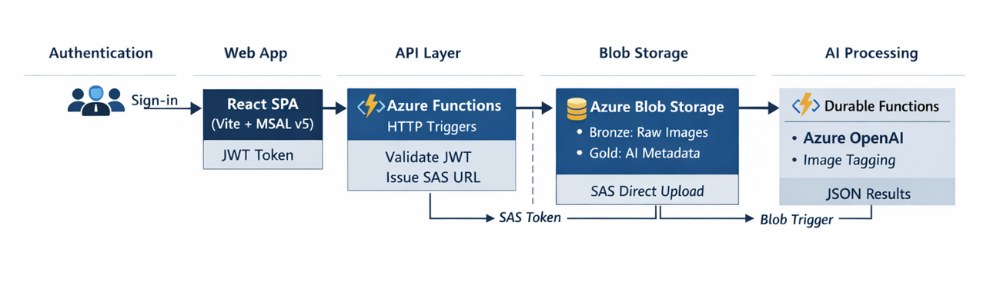
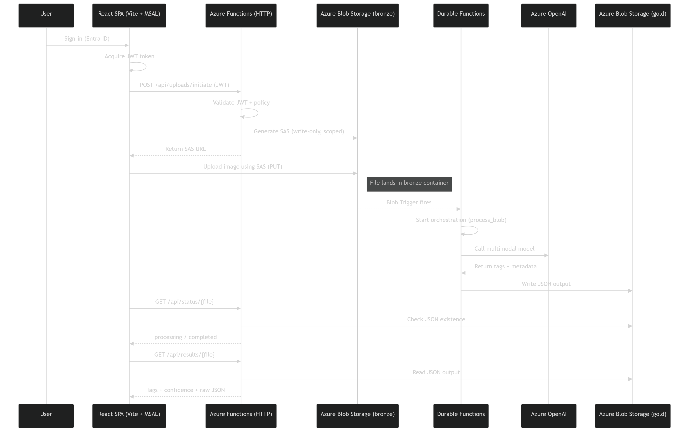

# Getting Started — Starter Kit UI

This guide walks through every step to go from a fresh clone to a running application — locally in demo mode, locally against Azure, and deployed to the cloud. Each step references the architecture diagram and explains which component it configures.



---

## Table of Contents

- [Platform Components](#platform-components)
  - [Frontend: React + Azure Static Web Apps](#frontend-react--azure-static-web-apps)
  - [Primary API Layer: Azure Functions (Python)](#primary-api-layer-azure-functions-python)
  - [Secondary API Layer: Azure App Service / FastAPI (Optional)](#secondary-api-layer-azure-app-service--fastapi-optional)
  - [Data & Storage: Azure Blob Storage](#data--storage-azure-blob-storage)
  - [Security: Entra ID, RBAC, and SAS Tokens](#security-entra-id-rbac-and-sas-tokens)
- [Prerequisites](#prerequisites)
- [Quick Start: Demo Mode](#quick-start-demo-mode-no-azure-required)
- [Production Setup: Step by Step](#production-setup-step-by-step)
- [Deploying to Azure](#deploying-to-azure)
- [Troubleshooting](#troubleshooting)
- [Related Documentation](#related-documentation)

---

## Platform Components

The architecture diagram above shows six layers. This section describes the technology, role, and configuration of each component in detail.

---

### Frontend: React + Azure Static Web Apps

> **Architecture column:** Web App

#### Technology Stack

| Technology | Version | Purpose |
|---|---|---|
| [React](https://react.dev/) | 19.1 | Component framework |
| [TypeScript](https://www.typescriptlang.org/) | 5.8 | Type-safe JavaScript |
| [Vite](https://vite.dev/) | 6.3 | Dev server and build tooling |
| [@azure/msal-browser](https://github.com/AzureAD/microsoft-authentication-library-for-js) | 5.x | Entra ID authentication (browser) |
| [@azure/msal-react](https://github.com/AzureAD/microsoft-authentication-library-for-js/tree/dev/lib/msal-react) | 5.x | React hooks and components for MSAL |

#### How It Fits in the Architecture

The React SPA is the user-facing layer in the diagram. It handles three responsibilities:

1. **Authentication** — MSAL acquires a JWT access token from Entra ID via popup (Authorization Code + PKCE). Tokens are stored in `sessionStorage` and attached to every API call as `Authorization: Bearer <JWT>`.
2. **API communication** — `services/api.ts` calls the Azure Functions API endpoints. The API returns SAS URLs and metadata; no image bytes pass through the API.
3. **Direct blob upload** — After receiving a write SAS URL from `POST /api/upload`, the browser PUTs the file directly to Azure Blob Storage. This keeps large file transfers off the API layer.

#### Component Tree

```
<MsalProvider>                        ← MSAL context for all child components
  <App>                               ← Auth gating
    <UnauthenticatedTemplate>
      Sign-in button (loginPopup)
    </UnauthenticatedTemplate>
    <AuthenticatedTemplate>
      <UploadPage />                  ← File picker + client-side validation
      <ImageGallery />                ← Agency image list, auto-poll 10 s
        └─ <ImageDetail />            ← Preview + tags, auto-poll 5 s
           └─ <StatusBadge />         ← Pending / Completed / Failed
    </AuthenticatedTemplate>
  </App>
</MsalProvider>
```

The entry point `main.tsx` checks `import.meta.env.VITE_DEMO_MODE`. When `true`, it loads `DemoApp.tsx` with mock data and no MSAL dependency. When `false`, it dynamically imports MSAL, creates a `PublicClientApplication`, and wraps `<App />` in `<MsalProvider>`.

#### Azure Static Web Apps (SWA)

[Azure Static Web Apps](https://learn.microsoft.com/azure/static-web-apps/) hosts the production frontend. SWA provides:

| Capability | How It's Used |
|---|---|
| **Global CDN** | Serves the built React app from edge locations worldwide |
| **Managed SSL** | HTTPS with auto-renewed certificates — no configuration needed |
| **Built-in Entra ID auth** | `staticwebapp.config.json` routes `/api/*` behind `authenticated` role; unauthenticated users are redirected to `/.auth/login/aad` |
| **API proxying** | The SWA `linkedBackend` feature proxies `/api/*` requests to the Azure Functions app — the frontend sets `VITE_API_BASE_URL` to empty string in production |
| **Staging environments** | `stagingEnvironmentPolicy: Enabled` in the Bicep template creates preview environments for pull requests |

##### `staticwebapp.config.json`

This file lives in `app/frontend/public/` (copied to `build/` during Vite build) and controls SWA routing and security headers:

```json
{
  "navigationFallback": {
    "rewrite": "/index.html",
    "exclude": ["/assets/*", "/api/*"]
  },
  "routes": [
    {
      "route": "/api/*",
      "allowedRoles": ["authenticated"]
    }
  ],
  "responseOverrides": {
    "401": {
      "statusCode": 302,
      "redirect": "/.auth/login/aad"
    }
  },
  "globalHeaders": {
    "X-Content-Type-Options": "nosniff",
    "X-Frame-Options": "DENY",
    "Referrer-Policy": "strict-origin-when-cross-origin",
    "Permissions-Policy": "camera=(), microphone=(), geolocation=()"
  }
}
```

- **`navigationFallback`** — Rewrites all non-asset, non-API routes to `index.html` so React Router works with client-side navigation.
- **`routes`** — Requires the `authenticated` role for any `/api/*` call, enforced at the SWA edge before the request reaches Azure Functions.
- **`responseOverrides`** — 401 responses redirect to the built-in Entra ID login flow (`/.auth/login/aad`), providing a double layer of auth alongside MSAL.
- **`globalHeaders`** — Security headers applied to every response (OWASP recommended).

##### CI/CD Deployment Options

SWA supports two CI/CD patterns:

**GitHub Actions (recommended):**
When you link a GitHub repository to the SWA resource, Azure auto-generates a GitHub Actions workflow (`.github/workflows/azure-static-web-apps-*.yml`). Pushes to `main` trigger build + deploy automatically.

> See [Azure Static Web Apps with GitHub Actions](https://learn.microsoft.com/azure/static-web-apps/github-actions-workflow)

**Azure DevOps Pipelines:**
Use the `AzureStaticWebApp@0` task in an Azure Pipelines YAML file:

```yaml
- task: AzureStaticWebApp@0
  inputs:
    app_location: 'app/frontend'
    output_location: 'build'
    azure_static_web_apps_api_token: $(DEPLOYMENT_TOKEN)
```

> See [Azure Static Web Apps with Azure DevOps](https://learn.microsoft.com/azure/static-web-apps/publish-devops)

**Manual CLI deploy** (used in this guide):

```powershell
npx @azure/static-web-apps-cli deploy ./build --deployment-token $token
```

##### Bicep Provisioning

The SWA resource is defined in `infra/modules/static-web-app.bicep`:

```bicep
resource staticWebApp 'Microsoft.Web/staticSites@2024-04-01' = {
  name: staticWebAppName
  location: location
  sku: { name: sku, tier: sku }    // 'Free' or 'Standard'
  properties: {
    stagingEnvironmentPolicy: 'Enabled'
    allowConfigFileUpdates: true
    buildProperties: {
      appLocation: 'app/frontend'
      outputLocation: 'build'
    }
  }
}
```

The Free tier is sufficient for development. The Standard tier ($9/month) adds custom domains, staging slots, and higher bandwidth. See [infra/README.md](../infra/README.md) for all parameters.

---

### Primary API Layer: Azure Functions (Python)

> **Architecture column:** API Layer — Validate JWT, Issue SAS URL

#### Technology Stack

| Technology | Version | Purpose |
|---|---|---|
| [Azure Functions](https://learn.microsoft.com/azure/azure-functions/) | v2 (Python) | Serverless HTTP API hosting |
| Python | 3.13+ | Runtime language |
| [Blueprints model](https://learn.microsoft.com/azure/azure-functions/functions-reference-python?tabs=get-started%2Casgi%2Capplication-level&pivots=python-mode-decorators#blueprints) | v2 | Modular route registration |
| [python-jose](https://github.com/mpdavis/python-jose) | 3.3.0 | RS256 JWT validation |
| [azure-storage-blob](https://pypi.org/project/azure-storage-blob/) | 12.24+ | Blob CRUD and SAS generation |
| [azure-identity](https://pypi.org/project/azure-identity/) | 1.19+ | `DefaultAzureCredential` for managed identity |

#### How It Fits in the Architecture

The Azure Functions app sits between the frontend and Blob Storage. Every API call passes through JWT validation (`shared/auth.py`) before any business logic executes. The API never handles raw file bytes — it issues time-limited SAS URLs so the browser uploads directly to storage.

#### HTTP Triggers — Endpoints

| Blueprint | Module | Trigger | Endpoints | Purpose |
|---|---|---|---|---|
| `upload_bp` | `upload_initiate/` | HTTP | `POST /api/upload` | Validate upload request, generate write SAS URL, create metadata |
| `status_bp` | `get_status/` | HTTP | `GET /api/images`, `GET /api/images/{id}`, `DELETE /api/images/{id}` | List images, return detail with preview SAS URL, delete |
| `results_bp` | `get_results/` | HTTP | `GET /api/images/{id}/tags` | Return AI-generated tags from gold container |

All endpoints require a valid Entra ID Bearer token. The auth level is set to `ANONYMOUS` in `function_app.py` because JWT validation is handled in application code (not the Functions host), giving full control over error responses and claim extraction.

#### Blob/Event Grid Triggers — Event-Driven Processing

The **existing Durable Functions pipeline** (separate from this codebase) uses a **blob trigger** on the `bronze` container to detect new uploads. When the starter kit UI uploads an image to `bronze`, the pipeline:

1. Fires the blob trigger → starts a Durable Functions orchestration.
2. Reads the image and calls Azure OpenAI (`callAoaiMultiModal`).
3. Writes results to `gold/{upload_id}_{basename}-output.json`.

For teams extending this pattern, Azure Functions supports additional trigger types:

| Trigger Type | Use Case | Documentation |
|---|---|---|
| **Blob trigger** | React to new/modified blobs | [Blob trigger](https://learn.microsoft.com/azure/azure-functions/functions-bindings-storage-blob-trigger) |
| **Event Grid trigger** | Low-latency event-driven processing | [Event Grid trigger](https://learn.microsoft.com/azure/azure-functions/functions-bindings-event-grid-trigger) |
| **Timer trigger** | Scheduled cleanup/maintenance jobs | [Timer trigger](https://learn.microsoft.com/azure/azure-functions/functions-bindings-timer) |

#### Shared Modules

| Module | File | Responsibility |
|---|---|---|
| **Auth** | `shared/auth.py` | Fetches OIDC signing keys from Entra ID, validates RS256 JWT, extracts `CurrentUser` (email, name, oid, agency) |
| **Storage** | `shared/storage.py` | Blob CRUD — upload, download, delete, list, exists. Metadata lifecycle — create, get, refresh status, list by agency, delete |
| **SAS** | `shared/sas.py` | SAS URL generation — `generate_read_sas_url()` (30 min, read-only) and `generate_write_sas_url()` (15 min, write+create). Both use user-delegation keys |

---

### Secondary API Layer: Azure App Service / FastAPI (Optional)

> **Architecture column:** API Layer (alternative)

#### Technology Stack

| Technology | Version | Purpose |
|---|---|---|
| [Azure App Service](https://learn.microsoft.com/azure/app-service/) | Windows or Linux | Always-on managed hosting |
| [FastAPI](https://fastapi.tiangolo.com/) | Latest | High-performance Python web framework |
| [Uvicorn](https://www.uvicorn.org/) | Latest | ASGI server for FastAPI |
| [Pydantic Settings](https://docs.pydantic.dev/latest/concepts/pydantic_settings/) | v2 | Environment-variable-driven configuration |

#### When to Use This Layer

The FastAPI backend at `app/backend/` is an **alternative** implementation included for scenarios where Azure Functions is not suitable:

| Scenario | Use Functions (Primary) | Use App Service / FastAPI (Secondary) |
|---|---|---|
| Lightweight HTTP APIs with variable traffic | ✅ Scales to zero, pay-per-execution | ❌ Always-on cost |
| Long-running requests (>10 min) | ❌ Timeout limits | ✅ No execution timeout |
| WebSocket / streaming responses | ❌ Limited support | ✅ Full ASGI support |
| Always-on with predictable traffic | ⚠️ Cold starts possible | ✅ No cold start |
| Development/prototyping | ✅ Quick with `func start` | ✅ Quick with `uvicorn` |

#### How It Fits in the Architecture

The FastAPI backend implements the **same API endpoints and auth flow** as Azure Functions. It connects to the same Blob Storage containers and validates the same Entra ID JWTs. In the architecture diagram, it occupies the same position as the Azure Functions API layer — you use one or the other, not both simultaneously.

#### Running Locally

```powershell
cd app\backend
pip install -r requirements.txt

# Configure environment
copy ..\..\..\.env.example .env
# Edit .env with your Azure credentials (same values as local.settings.json)

uvicorn main:app --reload --port 8000
```

The FastAPI backend starts at `http://localhost:8000` with Swagger docs at `http://localhost:8000/docs`.

Update the frontend to point to the FastAPI backend:

```env
VITE_API_BASE_URL=http://localhost:8000
```

#### Key Differences from the Functions API

| Aspect | Azure Functions | FastAPI Backend |
|---|---|---|
| Entry point | `function_app.py` (Blueprints) | `main.py` (FastAPI app) |
| Config | `local.settings.json` | `.env` via Pydantic `Settings` |
| Auth middleware | `shared/auth.py` → `validate_token(req)` | `auth.py` → `get_current_user()` (FastAPI dependency) |
| CORS | Configured in `host.json` / Azure Portal | Configured via `CORSMiddleware` in code |
| Health check | Not included | `GET /api/health` |
| Deployment target | Azure Functions | Azure App Service |

#### Deploying to Azure App Service

```powershell
# Create an App Service Plan and Web App
az appservice plan create --name <your-plan> --resource-group <your-rg> --sku B1 --is-linux
az webapp create --name <your-app> --resource-group <your-rg> --plan <your-plan> --runtime "PYTHON:3.13"

# Configure startup command
az webapp config set --name <your-app> --resource-group <your-rg> --startup-file "uvicorn main:app --host 0.0.0.0 --port 8000"

# Deploy
cd app\backend
az webapp deploy --name <your-app> --resource-group <your-rg> --src-path .
```

> See [Azure App Service Python quickstart](https://learn.microsoft.com/azure/app-service/quickstart-python)

---

### Data & Storage: Azure Blob Storage

> **Architecture column:** Blob Storage

#### Technology Stack

| Technology | Purpose |
|---|---|
| [Azure Blob Storage](https://learn.microsoft.com/azure/storage/blobs/) | Object storage for images, AI output, and metadata |
| [azure-storage-blob SDK](https://pypi.org/project/azure-storage-blob/) (Python) | Server-side blob operations |
| [SAS tokens](https://learn.microsoft.com/azure/storage/common/storage-sas-overview) | Time-limited browser-to-storage direct upload/download |
| [User delegation keys](https://learn.microsoft.com/azure/storage/blobs/storage-blob-user-delegation-sas-create-dotnet) | SAS keys signed by Entra ID identity (no storage account keys) |

#### Container Layout

| Container | Access Pattern | Contents | Naming Convention |
|---|---|---|---|
| `bronze` | Write (SAS from browser), Read (API via managed identity) | Original uploaded images | `{upload_id}_{sanitized_name}.{ext}` |
| `gold` | Write (Durable Functions), Read (API via managed identity) | AI tagging output (JSON) | `{upload_id}_{sanitized_name}-output.json` |
| `ui-metadata` | Read/Write (API via managed identity) | Per-agency upload tracking | `{agency}/{upload_id}.json` |

All containers are configured with:

- **Private access level** — `allowBlobPublicAccess: false`
- **No shared key access** — managed identity (RBAC) only in production
- **Soft delete** — enabled for recovery (configurable in `infra/modules/storage.bicep`)

#### Browser Uploads via SAS

The upload flow uses **Shared Access Signatures** to let the browser upload directly to Blob Storage. This keeps large files off the API layer and reduces latency:

```
1. Browser → POST /api/upload (JWT + metadata)
2. API validates JWT, generates upload_id
3. API calls generate_write_sas_url(bronze, blob_name)
   └─ Requests a user delegation key from Entra ID
   └─ Signs a blob-scoped SAS token (write+create, 15-min expiry)
4. API returns { sas_url, upload_id, ... }
5. Browser → PUT <sas_url> (raw file bytes, x-ms-blob-type: BlockBlob)
   └─ Goes directly to Blob Storage — does NOT pass through the API
```

The SAS token permits **only** writing to the specific blob path. It cannot list, read, or delete other blobs. See [security.md](security.md) for the full SAS token security model.

#### Read SAS for Previews

When the UI requests image detail (`GET /api/images/{id}`), the API generates a **read-only SAS URL** (30-min expiry) for the `bronze` blob. The browser loads the image directly from Blob Storage via ``.

---

### Security: Entra ID, RBAC, and SAS Tokens

> **Architecture column:** Authentication + cross-cutting concern

Security spans all layers of the architecture. This section summarizes the key controls; see [security.md](security.md) for the full threat model and OWASP alignment.

#### Microsoft Entra ID Authentication

Two app registrations provide end-to-end authentication:

| Registration | Used By | Flow |
|---|---|---|
| **Backend API** (`AZURE_CLIENT_ID`) | Azure Functions API | JWT `aud` claim validation — ensures tokens were issued for this API |
| **Frontend SPA** (`VITE_AZURE_CLIENT_ID`) | React app (MSAL) | Authorization Code + PKCE via popup — obtains access token with `access_as_user` scope |

**Authentication flow in the architecture:**

```
┌─────────┐   1. loginPopup()   ┌──────────────┐
│ Browser  │ ──────────────────▶ │  Entra ID    │
│ (MSAL)   │ ◀────────────────── │  /authorize  │
│          │   2. access_token   │  + /token     │
└────┬─────┘                     └──────────────┘
     │ 3. Authorization: Bearer <JWT>
     ▼
┌─────────────────┐   4. Validate JWT     ┌──────────────┐
│ Azure Functions  │ ────────────────────▶ │  Entra ID    │
│ (API Layer)      │   (fetch OIDC keys)   │  JWKS URI    │
└─────────────────┘                        └──────────────┘
```

- Tokens are stored in `sessionStorage` (cleared on tab close).
- MFA is enforced via tenant Conditional Access policy — no app-level MFA config needed.
- `staticwebapp.config.json` adds a second authentication layer at the SWA edge for `/api/*` routes.

#### Role-Based Access Control (RBAC)

RBAC is enforced at two levels:

**Azure resource level** — The Function App's system-assigned managed identity receives least-privilege roles via `infra/modules/security.bicep`:

| Role | Role Definition ID | Grants |
|---|---|---|
| **Storage Blob Data Contributor** | `ba92f5b4-2d11-453d-a403-e96b0029c9fe` | Read, write, delete blobs and containers |
| **Storage Blob Delegator** | `db58b8e5-c6ad-4a2a-8342-4190687cbf4a` | Generate user-delegation SAS keys (required for SAS token issuance) |

No storage account keys are used in production. The Bicep template disables shared key access entirely.

**Application level — Agency isolation:**
The user's agency is extracted from the JWT `department` claim (fallback: `agency` claim, default: `"default"`). All data operations scope to the caller's agency:

- Metadata path: `ui-metadata/{agency}/{upload_id}.json`
- List endpoints return only records under the caller's agency prefix.
- Cross-agency data access is prevented without explicit RBAC roles.

#### Short-Lived, Permission-Scoped SAS Tokens

| SAS Type | Permission | Scope | Expiry | When Issued |
|---|---|---|---|---|
| **Write SAS** | `write`, `create` | Single blob in `bronze` | 15 minutes | After JWT validation on `POST /api/upload` |
| **Read SAS** | `read` | Single blob in `bronze` | 30 minutes | On `GET /api/images/{id}` for preview URL |

Key controls:

- **Blob-scoped** — cannot list or access other blobs.
- **User delegation keys** — signed by the Function App's managed identity via Entra ID, not storage account keys. Keys are revocable by disabling the managed identity.
- **Short-lived** — unusable after expiry. No long-lived tokens are ever issued.
- **Server-side only** — SAS URLs are generated in API code (`shared/sas.py`). Storage account keys and connection strings are never exposed to the browser.

---

## Prerequisites

### Local Development Tools

| Tool | Version | Installation |
|---|---|---|
| **Python** | 3.13+ | [python.org](https://www.python.org/downloads/) |
| **Node.js** | 18+ | [nodejs.org](https://nodejs.org/) |
| **npm** | 9+ | Bundled with Node.js |
| **Azure Functions Core Tools** | v4 | [Install guide](https://learn.microsoft.com/azure/azure-functions/functions-run-local#install-the-azure-functions-core-tools) |
| **Azure CLI** | 2.60+ | [Install guide](https://learn.microsoft.com/cli/azure/install-azure-cli) |
| **Git** | Latest | [git-scm.com](https://git-scm.com/) |

### Azure Resources (Production Only)

You need an Azure subscription with permissions to create resources. The following are required for production mode:

- A **resource group** to hold all resources
- A **storage account** with blob containers (`bronze`, `gold`, `ui-metadata`)
- Two **Entra ID app registrations** (frontend SPA + backend API)
- An **Azure Functions** host for the UI API
- An **Azure Static Web App** for the frontend
- The existing **Durable Functions pipeline** for AI image processing

> **Don't have Azure resources yet?** Skip to [Quick Start: Demo Mode](#quick-start-demo-mode-no-azure-required) to explore the full UI with mock data.

---

## Quick Start: Demo Mode (No Azure Required)

Demo mode runs a mock FastAPI server with sample data. No Azure subscription, Entra ID, or storage account is needed. This is the fastest way to explore the UI.

### 1. Clone and Set Up Python

```powershell
git clone <your-repository-url>
cd datahub_ui_poc
python -m venv .venv
.venv\Scripts\Activate.ps1          # Windows
pip install fastapi uvicorn
```

### 2. Install Frontend Dependencies

```powershell
cd app\frontend
npm install
cd ..\..
```

### 3. Launch Both Servers

```powershell
.\scripts\run-demo.ps1
```

| Service | URL |
|---|---|
| Frontend | http://localhost:3000 |
| Mock API | http://localhost:8000 |
| Swagger docs | http://localhost:8000/docs |

Press **Enter** in the launcher window to stop both processes.

In demo mode, the frontend loads `DemoApp.tsx` instead of `App.tsx` — no MSAL authentication is involved. The mock server at `app/demo/server.py` returns sample image data and simulates the upload/status/tags flow.

---

## Production Setup: Step by Step

The steps below follow the architecture diagram left to right. Each step builds on the [Platform Components](#platform-components) section above — refer back to it for technology details. This section focuses on **what to do and when**.

---

### Step 1: Provision Azure Resources (Blob Storage)

> **Architecture column:** Blob Storage — see [Data & Storage](#data--storage-azure-blob-storage) for full details.

This step creates the storage account and blob containers that hold uploaded images, AI output, and tracking metadata.

#### Option A: Deploy with Bicep (Recommended)

The `infra/` directory contains modular Bicep templates that provision all resources at once. See [infra/README.md](../infra/README.md) for the full deployment guide.

```powershell
az login
az account set --subscription "<your-subscription-id>"

# Create resource group
az group create --name <your-resource-group> --location <your-region>

# Edit parameters
# Open infra/main.bicepparam and fill in tenantId, apiClientId, etc.

# Preview
az deployment group what-if `
  --resource-group <your-resource-group> `
  --template-file infra/main.bicep `
  --parameters infra/main.bicepparam

# Deploy
az deployment group create `
  --resource-group <your-resource-group> `
  --template-file infra/main.bicep `
  --parameters infra/main.bicepparam
```

This creates the storage account, Function App, Static Web App, Log Analytics, Application Insights, and RBAC role assignments.

#### Option B: Manual Setup

If you prefer to create resources individually or already have a storage account:

1. Create a storage account (Standard LRS).
2. Create three blob containers: `bronze`, `gold`, `ui-metadata`.
3. Disable public blob access (`allowBlobPublicAccess: false`).
4. Assign the Function App's managed identity the **Storage Blob Data Contributor** and **Storage Blob Delegator** roles on the storage account.

#### What These Containers Do

| Container | Role in Architecture | Data Flow |
|---|---|---|
| `bronze` | Landing zone for raw uploads | Frontend → PUT via SAS URL |
| `gold` | AI processing output | Durable Functions → write JSON results |
| `ui-metadata` | Per-agency tracking records | API → read/write JSON metadata blobs |

> **Security note:** All containers are private. Access is through time-limited SAS tokens (user delegation keys) or managed identity. See [security.md](security.md) for details.

---

### Step 2: Register Entra ID Applications (Authentication)

> **Architecture column:** Authentication — see [Security: Entra ID, RBAC, and SAS Tokens](#security-entra-id-rbac-and-sas-tokens) for the full security model.

The authentication flow requires **two** app registrations in Microsoft Entra ID — one for the API (backend) and one for the SPA (frontend). The frontend obtains a JWT access token via MSAL, which the API validates on every request.

#### 2a. Backend API Registration

This registration represents the API layer in the architecture diagram. The API validates incoming JWTs against this registration's audience.

1. Go to **Azure Portal → Microsoft Entra ID → App registrations → New registration**.
2. Configure:

   | Setting | Value |
   |---|---|
   | Name | `Starter Kit UI API` |
   | Supported account types | Single tenant |

3. After creation, go to **Expose an API**:
   - Set **Application ID URI** to `api://<client-id>`.
   - Add a scope: `access_as_user` (admin consent: admins and users).

4. Record the **Application (client) ID** — this is `AZURE_CLIENT_ID` for the API.

#### 2b. Frontend SPA Registration

This registration represents the Web App column. MSAL in the React SPA uses it to authenticate users and acquire tokens.

1. Create another app registration:

   | Setting | Value |
   |---|---|
   | Name | `Starter Kit UI SPA` |
   | Supported account types | Single tenant |
   | Platform | Single-page application |
   | Redirect URIs | `http://localhost:3000` (add production URL after deploy) |

2. Go to **API permissions → Add a permission → My APIs**:
   - Select the backend API registration.
   - Add the `access_as_user` delegated permission.
   - Grant admin consent.

3. Record the **Application (client) ID** — this is `VITE_AZURE_CLIENT_ID` for the frontend.

#### How Authentication Connects the Components

```
User → Sign-in (MSAL popup) → Entra ID → JWT access token
                                              │
Frontend (Web App) stores token in sessionStorage
                                              │
Frontend → API call with Authorization: Bearer <JWT>
                                              │
API Layer validates JWT (audience, issuer, RS256 signature)
         extracts user identity + agency from claims
```

> **Reference:** [security.md](security.md) documents the full threat model, SAS token security, and OWASP alignment.

---

### Step 3: Configure and Run the API (API Layer)

> **Architecture column:** API Layer — see [Primary API Layer](#primary-api-layer-azure-functions-python) for technology details and [Secondary API Layer](#secondary-api-layer-azure-app-service--fastapi-optional) for the FastAPI alternative.

The API layer is an Azure Functions v2 app (Python) with three HTTP-triggered blueprints. It validates JWTs, generates SAS URLs for blob upload/preview, and manages metadata.

#### 3a. Configure Environment

Copy the example config and fill in your values:

```powershell
cd app\api
copy local.settings.json.example local.settings.json
```

Edit `local.settings.json`:

```json
{
  "IsEncrypted": false,
  "Values": {
    "AzureWebJobsStorage": "UseDevelopmentStorage=true",
    "FUNCTIONS_WORKER_RUNTIME": "python",
    "AZURE_STORAGE_ACCOUNT_URL": "https://<your-storage-account>.blob.core.windows.net",
    "AZURE_STORAGE_CONNECTION_STRING": "<your-storage-connection-string>",
    "AZURE_TENANT_ID": "<your-tenant-id>",
    "AZURE_CLIENT_ID": "<your-backend-api-client-id>",
    "AZURE_AUTHORITY": "https://login.microsoftonline.com/<your-tenant-id>",
    "BRONZE_CONTAINER": "bronze",
    "GOLD_CONTAINER": "gold",
    "METADATA_CONTAINER": "ui-metadata",
    "MAX_UPLOAD_SIZE_MB": "20",
    "ALLOWED_EXTENSIONS": "jpg,jpeg,png"
  },
  "Host": {
    "CORS": "http://localhost:3000",
    "CORSCredentials": true
  }
}
```

| Variable | Maps To | Purpose |
|---|---|---|
| `AZURE_TENANT_ID` | Authentication | Entra ID tenant for JWT validation |
| `AZURE_CLIENT_ID` | Authentication | Backend app registration (JWT audience) |
| `AZURE_STORAGE_ACCOUNT_URL` | Blob Storage | Storage account endpoint |
| `AZURE_STORAGE_CONNECTION_STRING` | Blob Storage | Local dev only — use managed identity in production |
| `BRONZE_CONTAINER` | Blob Storage | Container for raw uploads |
| `GOLD_CONTAINER` | Blob Storage | Container for AI output |
| `METADATA_CONTAINER` | Blob Storage | Container for tracking metadata |

> **Local dev:** Use `AZURE_STORAGE_CONNECTION_STRING` for convenience. **Deployed:** The Function App uses `DefaultAzureCredential` (managed identity) — no connection string needed.

#### 3b. Install Dependencies and Start

```powershell
pip install -r requirements.txt
func start
```

The API is available at `http://localhost:7071`. Test it:

```powershell
# Should return 401 (no token) — confirms the endpoint is live and auth is enforced
Invoke-RestMethod http://localhost:7071/api/images
```

#### API Blueprint Structure

| Blueprint | Module | Endpoints | Role |
|---|---|---|---|
| `upload_bp` | `upload_initiate/` | `POST /api/upload` | Validates request, generates write SAS URL, creates metadata |
| `status_bp` | `get_status/` | `GET /api/images`, `GET/DELETE /api/images/{id}` | Lists images, returns detail with preview SAS URL |
| `results_bp` | `get_results/` | `GET /api/images/{id}/tags` | Returns AI-generated tags from gold container |

> **Reference:** [architecture-ui.md](architecture-ui.md) documents the full data flow, component tree, and shared module details.

---

### Step 4: Configure and Run the Frontend (Web App)

> **Architecture column:** Web App — see [Frontend: React + Azure Static Web Apps](#frontend-react--azure-static-web-apps) for SWA configuration, CI/CD options, and the component tree.

The frontend is a React 19 SPA built with Vite and TypeScript. It authenticates users via MSAL and communicates with the API using JWT bearer tokens.

#### 4a. Install Dependencies

```powershell
cd app\frontend
npm install
```

#### 4b. Configure Environment

Copy the example and fill in your values:

```powershell
copy .env.example .env
```

Edit `.env`:

```env
VITE_API_BASE_URL=http://localhost:7071
VITE_AZURE_CLIENT_ID=<your-frontend-spa-client-id>
VITE_AZURE_AUTHORITY=https://login.microsoftonline.com/<your-tenant-id>
VITE_AZURE_REDIRECT_URI=http://localhost:3000
VITE_API_SCOPE=api://<your-backend-api-client-id>/access_as_user
VITE_DEMO_MODE=false
```

| Variable | Maps To | Purpose |
|---|---|---|
| `VITE_API_BASE_URL` | API Layer | Where the frontend sends API requests |
| `VITE_AZURE_CLIENT_ID` | Authentication | Frontend SPA app registration |
| `VITE_AZURE_AUTHORITY` | Authentication | Entra ID authority URL |
| `VITE_AZURE_REDIRECT_URI` | Authentication | OAuth redirect after login |
| `VITE_API_SCOPE` | Authentication → API Layer | Permission scope to request in the JWT |
| `VITE_DEMO_MODE` | — | Set `true` to bypass auth and use mock data |

#### 4c. Start the Dev Server

```powershell
npm start
```

Open `http://localhost:3000`. You should see a sign-in button. After authenticating with Entra ID, the upload page and image gallery load.

#### How the Frontend Connects to Other Components

1. **Authentication →** MSAL obtains a JWT from Entra ID via popup (`Authorization Code + PKCE`).
2. **Web App → API Layer →** `services/api.ts` sends the JWT as a Bearer token with every API call.
3. **Web App → Blob Storage →** After `POST /api/upload` returns a SAS URL, the frontend PUTs the file directly to Azure Blob Storage (no file bytes pass through the API).
4. **Web App ← API Layer →** The gallery and detail views poll the API, which checks the gold container and returns updated status.



---

### Step 5: Verify the AI Processing Pipeline (AI Processing)

> **Architecture column:** AI Processing — Durable Functions, Azure OpenAI, Image Tagging. See [Primary API Layer](#primary-api-layer-azure-functions-python) for blob/event trigger details.

The AI processing pipeline is **not part of this codebase** — it is an existing Azure Durable Functions orchestration that:

1. Detects new blobs in the `bronze` container (blob trigger).
2. Reads the image and sends it to Azure OpenAI via `callAoaiMultiModal`.
3. Writes the JSON result to `gold/{upload_id}_{basename}-output.json`.

#### Verify It's Working

After uploading an image through the UI:

1. Check the `bronze` container in the Azure Portal — the image blob should appear.
2. After 1–3 minutes, check the `gold` container — an `-output.json` file should appear.
3. The UI gallery auto-polls every 10 seconds. The status badge changes from **Pending** to **Completed**.
4. Click the image to see AI-generated tags in the detail view.

#### If Processing Doesn't Trigger

- Verify the Durable Functions app (`<your-processing-function-app>`) is running.
- Check the Function App log stream in the Azure Portal for errors.
- Confirm `AOAI_MULTI_MODAL` is set to `true` in App Configuration (`<your-app-configuration>`).
- Verify the Azure OpenAI endpoint and model deployment are accessible.

---

## Deploying to Azure

Once you've validated locally, deploy the full stack to Azure.

### 1. Deploy Infrastructure

If you haven't already, run the Bicep deployment from [Step 1](#step-1-provision-azure-resources-blob-storage). See [infra/README.md](../infra/README.md) for parameters and options.

### 2. Publish the API

```powershell
cd app\api
func azure functionapp publish <your-function-app-name>
```

### 3. Build and Deploy the Frontend

```powershell
cd app\frontend

# Create production env
copy .env.example .env.production
# Edit .env.production:
#   VITE_API_BASE_URL=           (empty — SWA proxies /api/*)
#   VITE_AZURE_CLIENT_ID=<your-frontend-spa-client-id>
#   VITE_AZURE_AUTHORITY=https://login.microsoftonline.com/<your-tenant-id>
#   VITE_AZURE_REDIRECT_URI=https://<your-swa-hostname>
#   VITE_API_SCOPE=api://<your-backend-api-client-id>/access_as_user

npm run build
```

Deploy the `build/` directory to Azure Static Web Apps:

```powershell
$token = az staticwebapp secrets list `
  --name <your-static-web-app-name> `
  --query "properties.apiKey" -o tsv

npx @azure/static-web-apps-cli deploy ./build --deployment-token $token
```

### 4. Post-Deployment Checklist

- [ ] Add the Static Web App URL as a **redirect URI** in the frontend Entra ID SPA app registration.
- [ ] Verify the Function App has `AZURE_TENANT_ID`, `AZURE_CLIENT_ID`, and `AZURE_STORAGE_ACCOUNT_URL` configured.
- [ ] Confirm the Function App managed identity has **Storage Blob Data Contributor** and **Storage Blob Delegator** RBAC roles.
- [ ] Update Function App CORS to allow the Static Web App hostname (Bicep defaults to `*.azurestaticapps.net`).
- [ ] Test end-to-end: sign in → upload image → wait for processing → view tags.

---

## Troubleshooting

| Symptom | Cause | Fix |
|---|---|---|
| Sign-in popup closes without authenticating | Redirect URI mismatch | Verify `VITE_AZURE_REDIRECT_URI` matches the redirect URI in the SPA app registration. |
| 401 on all API calls | JWT validation failure | Check `AZURE_TENANT_ID` and `AZURE_CLIENT_ID` in Function App settings match the backend app registration. |
| SAS URL returns 403 on upload | Missing RBAC role | Assign **Storage Blob Delegator** to the Function App managed identity on the storage account. |
| Image stays "Pending" indefinitely | Processing pipeline not triggered | Check the Durable Functions app log stream. Confirm `AOAI_MULTI_MODAL` is `true` in App Configuration. |
| CORS error in browser console | Missing allowed origin | Add the frontend origin to Function App CORS settings (Azure Portal → Function App → CORS). |
| `func start` fails locally | Missing dependencies or wrong Python | Run `pip install -r requirements.txt` and verify `python --version` is 3.13+. |
| Frontend shows blank page | Missing env vars | Ensure `.env` exists with all `VITE_` variables. Restart `npm start` after changes. |

---

## Related Documentation

| Document | Purpose |
|---|---|
| [architecture-ui.md](architecture-ui.md) | Component stack, data flows, API blueprint details, blob layout |
| [security.md](security.md) | Threat model, JWT validation, SAS token security, OWASP alignment |
| [starter-codebase.md](starter-codebase.md) | Blueprint disclaimer, customization guide, testing checklists, known limitations |
| [infra/README.md](../infra/README.md) | Bicep module reference, parameter guide, network isolation options, cost estimate |

### Microsoft Documentation

- [Azure Functions Python developer guide](https://learn.microsoft.com/azure/azure-functions/functions-reference-python)
- [Azure Static Web Apps](https://learn.microsoft.com/azure/static-web-apps/)
- [MSAL React (v5)](https://github.com/AzureAD/microsoft-authentication-library-for-js/tree/dev/lib/msal-react)
- [Entra ID app registrations](https://learn.microsoft.com/entra/identity-platform/quickstart-register-app)
- [Azure Blob Storage SAS tokens](https://learn.microsoft.com/azure/storage/common/storage-sas-overview)
- [Bicep documentation](https://learn.microsoft.com/azure/azure-resource-manager/bicep/)
